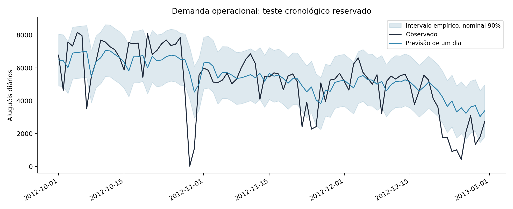

# Previsão de demanda para planejamento operacional

**Como antecipar o volume do próximo dia e saber se um modelo supera uma regra simples de planejamento?**

Projeto de séries temporais com aluguéis diários de bicicletas, backtesting cronológico, comparação com referência sazonal, avaliação de incerteza e auditoria dos atributos em SQL.

*One-day-ahead demand forecasting with rolling-origin backtests, leakage checks and uncertainty evaluation.*

## Resultado no teste reservado

| Indicador | Resultado |
|---|---:|
| Período de teste | 01/10/2012 a 31/12/2012 |
| Previsões sucessivas de um dia | 92 |
| Modelo escolhido nos backtests | Ridge, alpha 10 |
| MAE da referência sazonal | 1.457,6 aluguéis/dia |
| MAE do modelo | 960,8 aluguéis/dia |
| Redução de MAE | 34,1% |
| WAPE | 18,6% |
| Cobertura do intervalo nominal de 90% | 81,5% |

A menor cobertura é um resultado relevante: o intervalo foi calibrado em agosto–setembro e ficou otimista para outubro–dezembro. Essa limitação permanece exposta. O modelo simples venceu os candidatos de boosting nos backtests; complexidade adicional não foi tratada como objetivo.



[Leia os resultados e suas implicações](resultados/relatorio.md).

## Protocolo temporal

| Etapa | Treino | Avaliação |
|---|---|---|
| Backtest 1 | Até 30/04/2012 | Maio de 2012 |
| Backtest 2 | Até 31/05/2012 | Junho de 2012 |
| Backtest 3 | Até 30/06/2012 | Julho de 2012 |
| Ajuste final | Até 31/07/2012 | Sem consulta ao teste |
| Calibração de intervalo | Modelo final congelado | Agosto–setembro de 2012 |
| Teste | Modelo final congelado | Outubro–dezembro de 2012 |

O alvo é o número de aluguéis do próximo dia. A cada previsão, o histórico real até a véspera já está disponível. Não são 92 dias previstos de uma vez. Coeficientes ficam congelados durante calibração e teste, enquanto atributos de histórico são atualizados com observações já disponíveis.

São comparados sazonal ingênuo de sete dias, Ridge com dois valores de regularização e dois candidatos de gradient boosting. A seleção usa o menor MAE médio dos três backtests, sem usar o teste final.

## Atributos disponíveis no momento da previsão

- Calendário conhecido: feriado, dia útil e codificações cíclicas de dia da semana e dia do ano.
- Tendência em dias a partir de uma origem fixa.
- Demanda defasada em 1, 7, 14 e 28 dias.
- Médias móveis de 7 e 28 dias e desvio de 7 dias, sempre com deslocamento de um dia antes da janela.

`casual` e `registered` são excluídos porque somam diretamente o alvo. Temperatura, clima, vento e umidade realizados no dia previsto também são excluídos: não temos a previsão meteorológica que estaria disponível na origem. A série diária tem calendário completo; lacunas são rejeitadas, não transformadas silenciosamente em demanda zero.

## Métricas e incerteza

MAE mede erro absoluto típico em volume. RMSE dá maior peso a erros grandes. WAPE é a soma dos erros absolutos dividida pela soma da demanda. Viés positivo indica superestimação média.

O intervalo utiliza um quantil dos erros absolutos de calibração, com limite inferior truncado em zero. Sua avaliação é empírica: dependência temporal e mudanças de distribuição impedem uma garantia de cobertura. O IC da diferença de MAE usa 2.000 reamostragens por blocos móveis de sete dias, preservando parte da dependência local. A estimativa é condicionada à janela e ao modelo fixo.

## Decisão apoiada e limites

A previsão de volume ajuda a discutir carga operacional e redistribuição. Ela não determina tamanho de frota, número de funcionários ou estoque por estação: faltam tempos de viagem, capacidades, localização e demanda reprimida. Os dados são do Capital Bikeshare, em 2011–2012, e precisam de validação externa antes de aplicação em outra cidade.

O comando `prever.py` recebe atributos já preparados no formato de `exemplo_entrada.csv`. Para prever o dia seguinte diretamente de uma série diária completa, use `python prever.py dados/day.csv proximo_dia.csv --historico --feriado 1 --dia-util 0`. Esses valores de calendário correspondem a 01/01/2013, a data seguinte ao arquivo fornecido; ajuste-os conforme o calendário real ao usar novos dados. A função `preparar` aceita somente o último alvo ausente no modo de inferência; lacunas no histórico continuam sendo rejeitadas. O exemplo distribuído reproduz linhas históricas do teste, não uma previsão em tempo real.

## O que este repositório demonstra

Formulação de horizonte, backtesting, engenharia de atributos sem vazamento, comparação com baseline, escolha de modelo por evidência, quantificação de incerteza, análise de resíduos e conferência independente com funções de janela SQL.

## Fontes

- Fanaee-T, H. (2013). [Bike Sharing — UCI](https://archive.ics.uci.edu/dataset/275/bike+sharing+dataset), DOI [10.24432/C5W894](https://doi.org/10.24432/C5W894), CC BY 4.0. Acesso em 02/10/2026.
- [Documentação oficial: atributos defasados para previsão](https://scikit-learn.org/stable/auto_examples/applications/plot_time_series_lagged_features.html).

## Execução no Windows

Use Python 3.12. No terminal do VS Code, dentro da pasta deste repositório:

```powershell
py -3.12 -m venv .venv
.venv\Scripts\python.exe -m pip install -r requirements.txt
.venv\Scripts\python.exe analise.py
.venv\Scripts\python.exe auditar_sql.py
.venv\Scripts\python.exe -m unittest discover -s tests -v
.venv\Scripts\python.exe prever.py exemplo_entrada.csv novas_previsoes.csv
```

No Linux/macOS, crie o ambiente com `python3.12 -m venv .venv` e use `.venv/bin/python` nos demais comandos. O script `prever.py` exige executar a análise primeiro, para criar `resultados/modelo.joblib`. Esse modelo local não integra o pacote nem o versionamento; é reconstruído pelo pipeline.

Os dados originais já acompanham o projeto. Para baixá-los novamente, execute `python dados.py`; o download valida SHA-256 antes de escrever os arquivos. `fonte.json` registra autoria, licença, URL e hashes. Os programas não dependem de API paga, dashboard, servidor ou credencial.

O notebook `estudo.ipynb` contém as células executadas e os resultados, para leitura no GitHub e reprodução no Jupyter ou VS Code. Instale o suporte Jupyter separadamente se desejar usá-lo; o pipeline principal funciona apenas com as dependências de `requirements.txt`.

## Organização

| Arquivo | Responsabilidade |
|---|---|
| `analise.py` | Executar seleção, avaliação, gráficos estáticos e relatório |
| `modelagem.py` | Regras de preparação, métricas e reamostragem |
| `prever.py` | Aplicar o modelo a um CSV sem conhecer o resultado real |
| `dados.py` | Download e verificação de integridade |
| `auditar_sql.py` e `sql/` | Conferência independente de agregações ou atributos |
| `tests/` | Testes dos riscos de erro relevantes ao problema |
| `resultados/` | Evidências da execução, métricas e conclusões |
| `.github/workflows/testes.yml` | Testes, reprodução da análise, auditoria SQL e entrega dos resultados a cada push ou pull request |

## Reprodutibilidade e escopo

Semente 42, dependências fixadas e versão de Python registrada em `ambiente.txt`. As partições e regras de escolha são auditáveis. Resultados são de avaliação offline em dados históricos, não impactos realizados em uma empresa. Os diagnósticos do teste não alimentam novo ajuste. Comentários não são usados no código; decisões e definições ficam na documentação.

## Licença

Código MIT. Dados e tabelas derivadas sob CC BY 4.0, com atribuição em `fonte.json`. Os projetos não são vinculados à operadora, ao sistema de bicicletas ou à UCI.

## Tecnologias utilizadas

| Tecnologia | Uso neste projeto | Competência demonstrada |
|---|---|---|
| Python 3.12 | Pipelines e comandos de treino e previsão | Programação aplicada a dados |
| pandas e NumPy | Preparação, atributos, métricas e reamostragem | Manipulação de dados e estatística computacional |
| scikit-learn | Pipelines, modelos e seleção | Machine learning com avaliação reproduzível |
| SQL e SQLite | Conferência independente de resultados | Consultas, agregações e funções de janela |
| Jupyter Notebook | Estudo com resultados executados | Comunicação técnica e exploração reproduzível |
| Matplotlib | Diagnósticos e gráficos estáticos | Avaliação e comunicação dos modelos |
| unittest | Testes de partições, métricas ou vazamento | Qualidade e prevenção de erros |
| GitHub Actions | Fluxo automático de testes e reprodução | Integração contínua de projeto de dados |
| joblib | Serialização local para inferência | Separação entre treinamento e uso do modelo |

O fluxo de GitHub Actions está configurado para reproduzir a análise e executar testes a cada push ou pull request. Os testes locais passaram; o estado de cada execução remota pode ser consultado na aba Actions.
